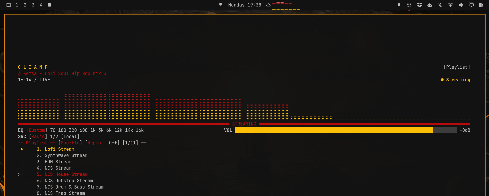

# Cliamp Visualiser

Cliamp's visualisers, alive in your Omarchy bar. It follows the active mode and colours in real time.

## 📸 Preview

<p align="center">
  
</p>

## 🎨 Theme-aware

The bar follows Cliamp's colours as you switch themes.

<p align="center">
  
</p>

## ✨ Highlights

- 🎨 Mirrors Cliamp's active visualiser and theme colours.
- ⚡ Animates at 30 FPS only while music is playing.
- ↔️ Drives stereo modes with a lightweight local audio meter.
- 🖱️ Left-click cycles modes. Right-click locks or unlocks switching.
- 📐 Fills its bar slot and scales each effect to fit.

## 🚀 Install

```bash
omarchy plugin add https://github.com/ollieedgeley/quickshell-cliamp-visualiser.git --enable
```

## 🗑️ Remove

```bash
omarchy plugin remove io.github.ollieedgeley.cliamp-visualiser
```

You can also delete the compiled fallback cache at `~/.cache/quickshell-cliamp-visualiser`.

## 🧪 Check it

```bash
omarchy plugin validate .
```

## ⚖️ License

[MIT](LICENSE) © 2026 Ollie Edgeley
