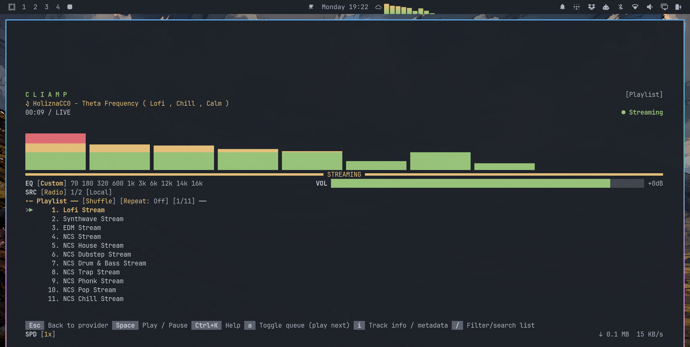

# Cliamp Visualiser

Cliamp's visualisers, alive in your Omarchy bar. It follows the active mode and colours in real time, with a local stereo meter when Cliamp does not expose the data itself.

## 📸 Preview



## ✨ Highlights

- 🎨 Mirrors Cliamp's active visualiser and theme colours.
- ⚡ Animates at 30 FPS only while music is playing.
- ↔️ Adds local stereo metering when a mode needs missing channel data.
- 🖱️ Left-click cycles modes. Right-click locks or unlocks switching.
- 📐 Fills its bar slot and scales each effect to fit.

## 📦 Requirements

- 🎵 Cliamp with `status --json` and `visstream` support.
- 🖥️ Omarchy Quattro with shell plugin support.
- 🔧 `cc`, `pkg-config`, and the `libpulse` headers for the stereo fallback.

The fallback helper compiles once into `~/.cache/quickshell-cliamp-visualiser`.

## 🚀 Install

```bash
omarchy plugin add https://github.com/ollieedgeley/quickshell-cliamp-visualiser.git --enable
```

## 🗑️ Remove

```bash
omarchy plugin remove io.github.ollieedgeley.cliamp-visualiser
```

You can also delete the compiled fallback cache at `~/.cache/quickshell-cliamp-visualiser`.

## 🧪 Check it

```bash
omarchy plugin validate .
```
